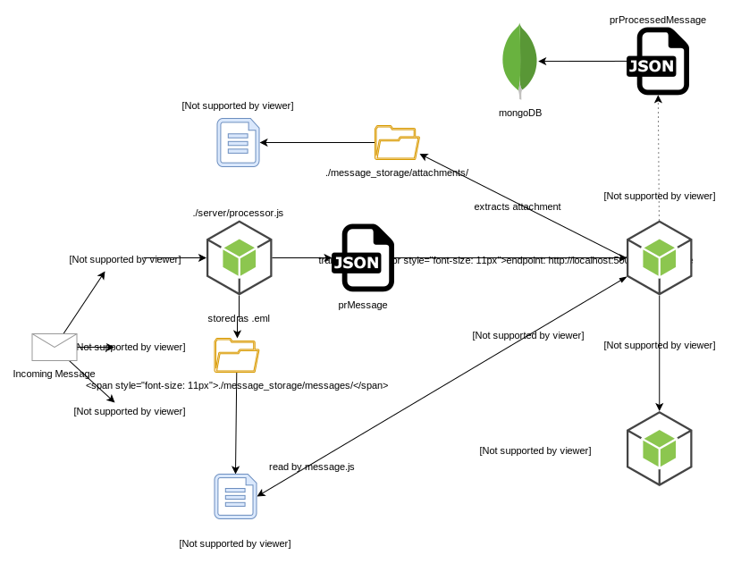

# postReceive
eMail to API transport project using 
- Nodemailer's [simpleParser](https://nodemailer.com/extras/mailparser/) for email body parsing. 
Seems like a fun project.

## Planned Features 
- [Tesseract.js](https://github.com/naptha/tesseract.js) OCR Engine for character recognition in images/PDFs/fax formats.
- Document parsing for full text searches of major document types (docx|odf/xlsx|ods/pptx/odfp/etc). 
 
## Documentation and Install instructions:
- [Documentation](https://treestarsystems.atlassian.net/wiki/spaces/PRD/overview)
- [Diagrams](https://treestarsystems.atlassian.net/wiki/spaces/PRD/pages/7831556/Diagrams)
- [Install Instructions](https://treestarsystems.atlassian.net/wiki/spaces/PRD/pages/6291592/Install)
- [Video Playlist](https://www.youtube.com/watch?v=_G_wdv-HTbI&list=PLFwrukKhzwLhIFpN1qufsp4UqORl_lDpp)

